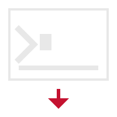

<p align="center">
  
</p>

# xtcli

A command-line client for [Xtream Codes](https://github.com/AmazingPhase/xtream-codes) IPTV servers. Browse live TV and VOD categories, search for content, view EPG data, play and download streams, manage favorites, and export playlists — all without leaving the terminal.

---

## Features

- **Browse** — List live TV and VOD categories and their streams; inspect individual stream details.
- **Search** — Case-insensitive full-text search across all streams or within a specific category.
- **Play** — Launch a stream directly in VLC with a single command.
- **Download** — Download VOD or live streams via VLC with real-time progress (MB + speed).
- **EPG** — View current and upcoming programme listings for any live stream.
- **Favorites** — Save, reorder, and manage a numbered list of favourite streams; play or download by name or number.
- **Dump** — Export a full XMLTV EPG feed or generate an M3U8 playlist for any set of streams.
- **Server info** — Display server details and account status (connections, expiry, allowed formats).
- **Multi-provider** — Configure multiple IPTV providers and switch between them with a single flag.
- **Cache** — Local cache with configurable TTL to avoid repeated server requests.

---

## Quick Start

```sh
# Create a default config file
xtcli config create

# Add a provider
xtcli config provider add --name myprovider --username user --password pass --host http://example.com

# List live TV categories
xtcli list categories

# Search for a stream
xtcli search stream "news"

# Play a stream (requires VLC)
xtcli play 12345

# Download a VOD (requires VLC)
xtcli download 67890 --type vod

# View server & account info
xtcli server info
```

---

## Building

### Requirements
- Go >= 1.24.7
- [VLC](https://www.videolan.org/) (required for `play` and `download` commands)

### Build
```
go build
```

---

## Documentation

- [Configuration](docs/configuration.md)
- [Providers](docs/providers.md)
- [Browsing](docs/browsing.md)
- [Searching](docs/searching.md)
- [Playing Streams](docs/playing.md)
- [Downloading Streams](docs/downloading.md)
- [Favorites](docs/favorites.md)
- [Cache](docs/cache.md)
- [Dumping Data](docs/dumping.md)
- [Server Info](docs/server-info.md)

